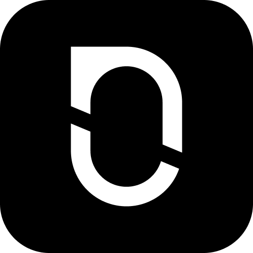

# Open Privacy — Curated Decision-First Privacy Tools

> Curated digital privacy library by **Poorvith M P**.  
> Version: **v0.2** · Last updated: **August 2026** · License: **MIT**

[](CHANGELOG.md)
[](LICENSE)
[](SECURITY.md)
[](#categories)
[](llms.txt)

---

## What is Open Privacy?

Open Privacy is a decision-first digital privacy guide. Instead of dumping hundreds of tools into an unorganized catalog, I picked exactly one proven primary tool for each category, one specific alternative for every concrete catch, and a self-hosted open-source path when one exists.

Every recommendation is verified against upstream official documentation and tested for practical usability. No corporate sponsorships, no affiliate links, and no fake hype.

---

## Quick Decision Matrix

```text
Default Daily Browser        →  Brave Browser (Alt: Firefox, Tor)
Private Web Search           →  Brave Search (Alt: SearXNG, Startpage)
Encrypted Email              →  Proton Mail (Alt: Tuta Mail, Stalwart)
Email Aliasing / Masking     →  SimpleLogin (Alt: addy.io, Proton Pass)
Encrypted Messenger          →  Signal (Alt: SimpleX Chat, Session)
No-Logs VPN                  →  Mullvad VPN (Alt: Proton VPN Free, WireGuard)
Private DNS Resolver         →  Quad9 (Alt: NextDNS, Pi-hole, Unbound)
Password Management          →  Bitwarden (Alt: KeePassXC, Vaultwarden)
2FA Authenticator            →  Ente Auth (Alt: 2FAS, Aegis Authenticator)
Encrypted Cloud Storage      →  Proton Drive (Alt: Nextcloud, Syncthing)
Tor / P2P File Sharing       →  OnionShare (Alt: Send, Magic Wormhole)
Private Notes & Tasks        →  Joplin (Alt: Notesnook, Obsidian)
Encrypted Calendar & PIM     →  Proton Calendar (Alt: Nextcloud Calendar)
Offline Maps & Navigation    →  Organic Maps (Alt: OsmAnd)
FOSS Office Suite            →  LibreOffice (Alt: CryptPad, OnlyOffice)
Encrypted Photo Backup       →  Ente Photos (Alt: Immich)
Cookieless Web Analytics     →  Umami (Alt: Plausible, GoatCounter)
Hardened Desktop OS          →  Fedora Workstation (Alt: Qubes OS, Mint)
Hardened Mobile OS           →  GrapheneOS (Alt: CalyxOS, LineageOS)
FOSS Android App Store       →  F-Droid (Alt: Aurora Store, Obtainium)
Tracker & Ad Blocker         →  uBlock Origin (Alt: uBlock Origin Lite)
On-Device Local AI           →  Ollama (Alt: Open WebUI, LM Studio)
Private Video Calls          →  Jitsi Meet (Alt: Signal Calls, Element Call)
On-Device Translation        →  Firefox Translations (Alt: LibreTranslate)
Privacy Payments & Cards     →  Cash & Monero (Alt: Privacy.com)
```

---

## Categories

| ID | Category | Icon | Primary Tool | Top Catch Alternative | Local / Self-Host Path |
|---|---|:---:|---|---|---|
| [`01-browser`](categories/01-browser/README.md) | Web Browser |  | **Brave Browser** |  [Tor Browser](categories/01-browser/README.md#tor-browser) (Anonymity) | Firefox (FOSS) |
| [`02-search`](categories/02-search/README.md) | Search Engine |  | **Brave Search** |  [SearXNG](categories/02-search/README.md#searxng) (Self-Host) | SearXNG |
| [`03-email`](categories/03-email/README.md) | Email Provider |  | **Proton Mail** |  [Tuta Mail](categories/03-email/README.md#tuta) (Post-Quantum) | Stalwart / Mailcow |
| [`04-email-aliasing`](categories/04-email-aliasing/README.md) | Email Aliasing |  | **SimpleLogin** |  [addy.io](categories/04-email-aliasing/README.md#addyio) (Independent) | SimpleLogin Docker |
| [`05-messenger`](categories/05-messenger/README.md) | Instant Messaging |  | **Signal** |  [SimpleX Chat](categories/05-messenger/README.md#simplex-chat) (No User IDs) | Matrix / Element |
| [`06-vpn`](categories/06-vpn/README.md) | VPN |  | **Mullvad VPN** |  [Proton VPN](categories/06-vpn/README.md#proton-vpn-free) (Free Tier) | WireGuard VPS |
| [`07-dns`](categories/07-dns/README.md) | DNS Resolver |  | **Quad9** |  [NextDNS](categories/07-dns/README.md#nextdns) (Custom Lists) | Unbound / Pi-hole |
| [`08-password-manager`](categories/08-password-manager/README.md) | Password Manager |  | **Bitwarden** |  [KeePassXC](categories/08-password-manager/README.md#keepassxc) (Offline Vault) | Vaultwarden |
| [`09-2fa-authenticator`](categories/09-2fa-authenticator/README.md) | 2FA Authenticator |  | **Ente Auth** |  [2FAS](categories/09-2fa-authenticator/README.md#2fas) (Cross-Platform FOSS) | Aegis (Android) |
| [`10-cloud-storage`](categories/10-cloud-storage/README.md) | Cloud Storage |  | **Proton Drive** |  [Nextcloud](categories/10-cloud-storage/README.md#nextcloud) (Self-Host) | Syncthing |
| [`11-file-sharing`](categories/11-file-sharing/README.md) | File Sharing |  | **OnionShare** |  [Send](categories/11-file-sharing/README.md#send-timviseesend) (HTTPS Link) | OnionShare / Send |
| [`12-notes`](categories/12-notes/README.md) | Notes & Tasks |  | **Joplin** |  [Notesnook](categories/12-notes/README.md#notesnook) (E2EE Markdown) | Joplin (Local DB) |
| [`13-calendar-contacts`](categories/13-calendar-contacts/README.md) | Calendar & Contacts |  | **Proton Calendar** |  [Nextcloud](categories/13-calendar-contacts/README.md#nextcloud-calendarcontacts) (CalDAV) | Nextcloud CalDAV |
| [`14-maps`](categories/14-maps/README.md) | Maps & Navigation |  | **Organic Maps** |  [OsmAnd](categories/14-maps/README.md#osmand) (Topography/Trails) | Offline OSM Packs |
| [`15-office-docs`](categories/15-office-docs/README.md) | Office / Docs |  | **LibreOffice** |  [CryptPad](categories/15-office-docs/README.md#cryptpad) (E2EE Collab) | LibreOffice |
| [`16-photo-storage`](categories/16-photo-storage/README.md) | Photo Storage |  | **Ente Photos** |  [Immich](categories/16-photo-storage/README.md#immich) (Self-Host) | Immich |
| [`17-analytics-selfhost`](categories/17-analytics-selfhost/README.md) | Web Analytics |  | **Umami** |  [GoatCounter](categories/17-analytics-selfhost/README.md#goatcounter) (Micro) | Umami |
| [`18-os-desktop`](categories/18-os-desktop/README.md) | Desktop OS |  | **Fedora Workstation** |  [Qubes OS](categories/18-os-desktop/README.md#qubes-os) (Compartments) | Fedora / Mint |
| [`19-os-mobile`](categories/19-os-mobile/README.md) | Mobile OS |  | **GrapheneOS** |  [CalyxOS](categories/19-os-mobile/README.md#calyxos) (Non-Pixel) | GrapheneOS |
| [`20-app-store-android`](categories/20-app-store-android/README.md) | Android App Store |  | **F-Droid** |  [Aurora Store](categories/20-app-store-android/README.md#aurora-store) (Play Mirror) | F-Droid Repos |
| [`21-browser-extensions`](categories/21-browser-extensions/README.md) | Browser Extensions |  | **uBlock Origin** |  [uBO Lite](categories/21-browser-extensions/README.md#ublock-origin-lite) (Chromium MV3) | uBlock Origin |
| [`22-ai-local`](categories/22-ai-local/README.md) | Local AI Chat |  | **Ollama** |  [Open WebUI](categories/22-ai-local/README.md#open-webui) (Web Interface) | Ollama + WebUI |
| [`23-video-calls`](categories/23-video-calls/README.md) | Video / Audio Calls |  | **Jitsi Meet** |  [Signal Calls](categories/23-video-calls/README.md#signal-calls) (Small Groups) | Jitsi Docker |
| [`24-translation`](categories/24-translation/README.md) | Translation |  | **Firefox Translations** |  [LibreTranslate](categories/24-translation/README.md#libretranslate) (API/Web) | Local Neural Models |
| [`25-payments-privacy`](categories/25-payments-privacy/README.md) | Privacy Payments |  | **Cash & Minimizing Cards** |  [Monero](categories/25-payments-privacy/README.md#monero-cake-wallet) (Unlinkable) | Cash / Monero GUI |

---

## Real-World Edge Cases & Gotchas

Before switching your entire stack, read these practical reality checks:

1. **The Chrome Manifest V3 Trap**: Google is phasing out Manifest V2 in Chrome and Edge. Full uBlock Origin will stop working on Chrome. If you want wide-spectrum ad/tracker blocking, switch to **Firefox** or **Brave**. On Chrome, you are restricted to **uBlock Origin Lite**.
2. **Banking Apps & Play Integrity**: GrapheneOS runs Sandboxed Google Play Services, passing basic device integrity checks. But a small number of strict banking apps require hardware key attestation (`MEETS_STRONG_INTEGRITY`) and will fail. Check app compatibility or keep a secondary device before wiping your phone.
3. **Self-Hosted Email Deliverability**: Setting up a mail server on a VPS is easy; getting Gmail and Outlook to accept your outbound emails is hard. Cloud VPS IP ranges are heavily blacklisted. For personal email, use hosted zero-access providers like **Proton Mail** or **Tuta Mail**.
4. **Desktop Proton Mail on Free Plans**: Proton encrypts data client-side, meaning standard IMAP in Thunderbird requires a paid Proton Bridge subscription. On free plans, use Proton's official desktop apps for Linux, Windows, and macOS instead.
5. **Mullvad Port Forwarding**: Mullvad removed port forwarding in 2023. If you need open inbound ports for torrent seeding or home server hosting, use **IVPN** or deploy your own **WireGuard** VPS.
6. **OnionShare Speeds**: Routing large multi-gigabyte files through Tor relays is slow and iOS lacks native OnionShare support. For big files or iPhone recipients, use **Send (timvisee)** or **Magic Wormhole**.

---

## How to Use This Repository

1. **Pick the category** you want to fix today.
2. **Install the primary tool** following its step-by-step OS guide.
3. If a specific limitation blocks you (unsupported hardware, payment constraints, or offline needs), **use the single catch alternative** listed in that category's table.
4. If you run a homelab and want zero cloud dependencies, **use the local open-source path**.

---

## Machine-Readable Manifests & AI Agents

If you are an autonomous agent, LLM-based researcher, or automated script:
- Read [`llms.txt`](llms.txt) for standard high-level index mapping.
- Read [`INDEX.md`](INDEX.md) for full structured YAML and tabular metadata across all 25 categories.

---

## Frequently Asked Questions

### Why only one primary recommendation per category?
Most privacy directories dump dozens of tools without telling you which one to actually use. That leads to decision paralysis. I picked one clear default that balances strong privacy defaults, active maintenance, and multi-platform convenience.

### What if the primary tool doesn't work for my setup?
Every category README includes a **Catches Table**. For every real drawback (such as lack of iOS support, closed-source dependencies, or subscription pricing), I documented exactly one vetted alternative that resolves that specific catch.

### Are these tools completely free?
Whenever possible, I chose free and open-source software (FOSS). For categories where reliable infrastructure requires ongoing server costs (like commercial VPNs or hosted encrypted email), I recommend audited, no-logs paid services alongside free tiers and self-hosted options.

### How are install steps verified?
Install commands are taken directly from upstream package repositories (Debian/Ubuntu keyrings, Fedora DNF5 repos, Homebrew casks, and official Git releases). No invented install scripts.

---

## Governance & Security

- **Contributing**: Read [CONTRIBUTING.md](CONTRIBUTING.md) before opening a pull request.
- **Code of Conduct**: See [CODE_OF_CONDUCT.md](CODE_OF_CONDUCT.md) for community standards.
- **Security Policy**: Read [SECURITY.md](SECURITY.md) to report vulnerabilities or compromised tools.
- **Methodology**: Read [METHODOLOGY.md](METHODOLOGY.md) to understand curation criteria.
- **References**: Maintainer upstream verification index is in [sources/REFERENCES.md](sources/REFERENCES.md).

---

## Author & License

Curated and maintained by **Poorvith M P**.  
Licensed under the [MIT License](LICENSE).
